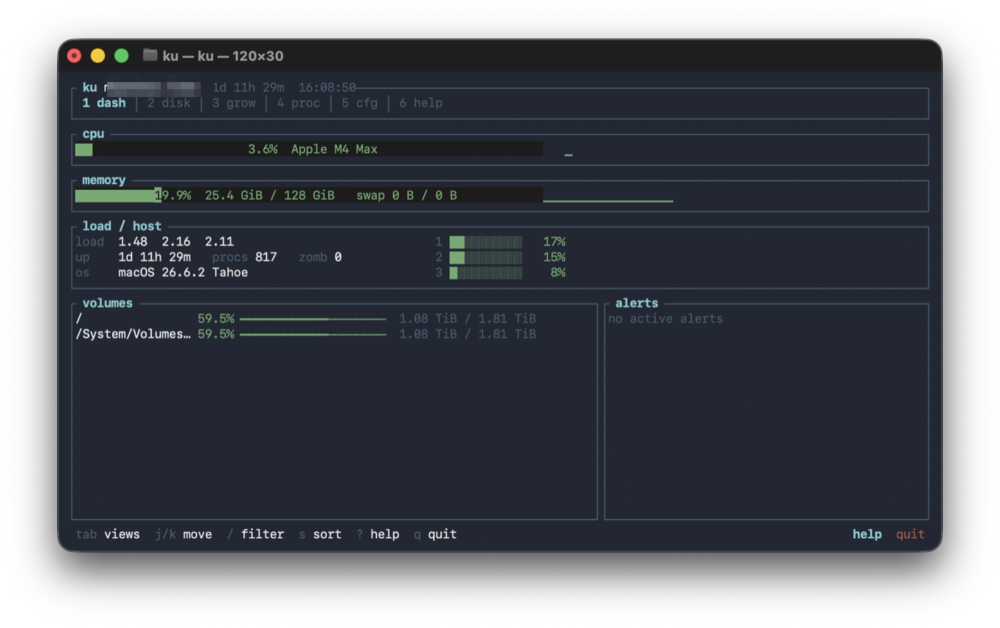
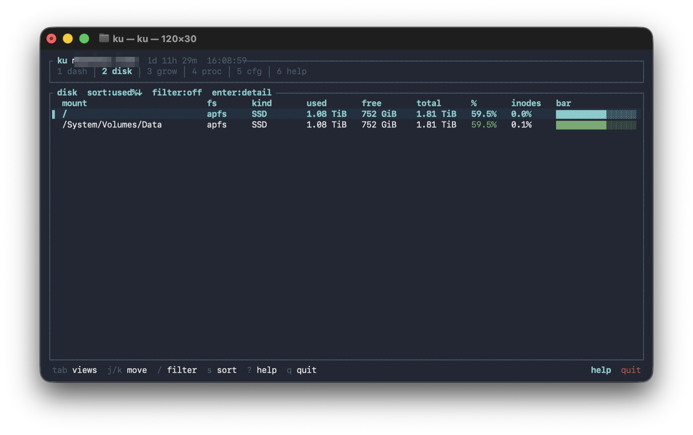
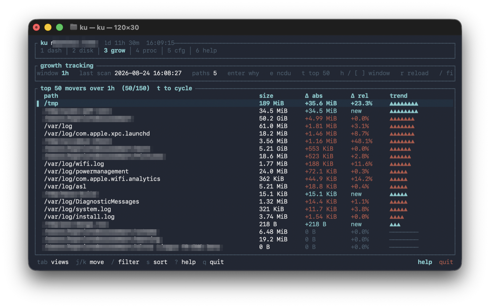

# ku

**English** · [Français](README.fr.md)

[](https://github.com/sponsors/noematic-eu)
[](https://www.patreon.com/noematic-eu)
[](https://payhip.com/b/pVwaY)

```
 _           
| | ___ _   _ 
| |/ / | | | |
|   <  | |_| |
|_|\_\  \__,_|
htop + df + ncdu
```

A sysadmin TUI for Linux and macOS. Live CPU, memory, volumes, and processes — plus what `htop` does not do. **Growth** shows which folders grew or vanished, and *why* (file vs recursive tree). **Orphans** lists leftover data from uninstalled apps. Written in Rust with [ratatui](https://ratatui.rs).







## Install / run

```bash
cargo install --path .
ku
```

```bash
cargo run --release
```

```bash
ku --config /path/to/config.toml
ku --dump-config
ku --once                 # one text snapshot, no TUI
sudo ku                   # same config/data dirs as SUDO_USER (not root)
```

App leftovers (always a dry-run unless you pass `--rm`):

```bash
ku orphans
ku orphans --json
sudo ku orphans           # also /Library and /var/lib when readable
ku orphans --rm PATH      # delete one path (asks for confirmation)
ku orphans --rm APP_ID --all
ku orphans --ignore APP_OR_PATH
ku orphans --fda          # macOS: open Full Disk Access settings
```

On macOS, deleting under `~/Library/Containers` (and similar) needs **Full Disk Access** for the **terminal app** (Terminal, iTerm, Ghostty…), not the `ku` binary. `sudo` does not bypass that. `F` in the leftovers view, or `ku orphans --fda`, opens the Privacy pane.

## Views

| Key | View |
|-----|------|
| `1` | Dashboard (CPU, memory, load, volumes, alerts) |
| `2` | Disk (volumes, inodes, thresholds) |
| `3` | Growth (folders that grew / shrank) |
| `4` | Processes (live + history) |
| `5` | Settings |
| `6` / `?` | Help |

## Shortcuts

- `Tab` / `Shift+Tab` — switch view
- `j` `k` or arrows — move
- `/` — filter (`nginx cpu>5 mem>100M user:root`)
- `s` / `S` — sort / reverse
- `Enter` — detail; Growth: why it changed (file vs recursive dir)
- `e` — Growth: `ncdu` if installed, else Finder / file manager
- `t` — Growth: top 50 contributions, or the full list
- `o` — leftover apps; `d` one path, `a` the whole group
- `i` / `I` — ignore a path / the whole app
- `F` — macOS: Full Disk Access
- `a` — process actions (kill, kill -9, renice, inspect)
- `h` — process history, or growth window
- `r` — reload
- `q` — quit
- mouse — tabs, config, rows (double-click = detail), wheel

## Configuration

Default file (the user who launched `ku`, including via `sudo`):

- Linux: `~/.config/ku/config.toml`
- macOS: `~/Library/Application Support/ku/config.toml`

```toml
[general]
refresh_interval = 2
theme = "dark"          # dark | light
history_retention_days = 7
page_jump = 0           # 0 = auto (~80% of visible rows)

[disk]
warning_threshold = 80
critical_threshold = 90
snapshot_interval = 300
watched_paths = [
  "/var/log",
  "/tmp"
]

[processes]
history_window = ["1m", "5m", "1h", "24h"]

[orphans]
ignore = []
```

## Data

SQLite snapshots (7-day retention, max 30):

- Linux: `~/.local/share/ku/history.db`
- macOS: `~/Library/Application Support/ku/history.db`

`sudo ku` reads and writes these paths for `SUDO_USER` (not `/var/root` / `/root`).

The growth scan of `watched_paths` runs in the background (`snapshot_interval`, 5 minutes by default).

## Support

Built by [Noematic](https://github.com/noematic-eu).

- [GitHub Sponsors](https://github.com/sponsors/noematic-eu)
- [Patreon](https://www.patreon.com/noematic-eu)
- [Payhip](https://payhip.com/b/pVwaY)

## License

[MIT](LICENSE)
